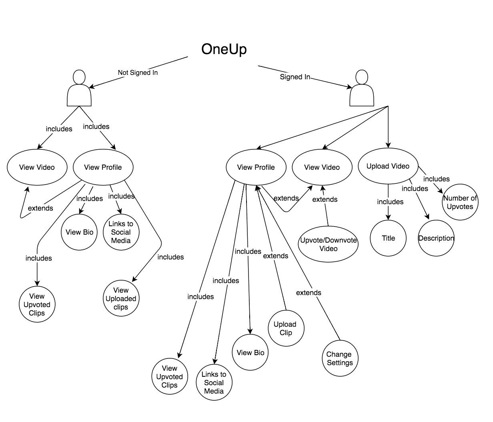

## 6.0 Architectural Design Document 

### 6.1 Introduction 

This document presents the architecture and detailed design for the software of the OneUp web application. OneUp contains user-uploaded skate clips that are curated by upvotes and downvotes from other users. 

#### 6.1.1 System Objectives

The objective of OneUp is to provide a platform where young skateboard talent can surface up democratically. Skaters are constantly aiming to build a personal brand and career centered around their talent, and OneUp will make this process easier.

In order to support this goal, OneUp contains three main components/features: user profile, uploaded videos, and upvoting system. Each uploaded video is curated to the top of the home page by the amount of upvotes from other users. Every clip can then be linked back to the profile of the user who uploaded the clip, which contains their biography and social media accounts that will help further the skater’s personal brand. 

Nonetheless, skate clips exist for the viewing pleasure of others. OneUp also aims to create a new form of skate media that allows anyone to enjoy skate clips while giving their input on which skate clips/skater deserves to be recognized through the use of upvotes and downvotes. 

OneUp aims to have a simple, but well designed architecture that will carry out these goals. All of the client side interface described above will interact with a node server and a cloud database system that can store, query, and return data. The user interface will easily allo

#### 6.1.2 Hardware, Software, and Human Interfaces

The three interfaces are interrelated through the network. The network connects the user to the back end components of the application namely the server and the database. The user experience comes when the user through the mouse/keyboard and the monitor sees the result when interacting with the application. Ajax helps giving the user the experience to establish the connections between the client and server. Moreover, ws or webSockets provide a persistent connection between a client and server that both parties can use to start sending data at any time to store and retrieve data to the database. 

Interface    | Contains 
-------------|------------------
Hardware     | Wireless network
Software     | Ajax
Software     | npm ws
Software     | GUI
Software     | Database (MongoDB)
Software     | Server (Node)
Human        | Mouse
Human        | Keyboard
Human        | Monitor

### 6.2 CSCI Description

- Front End/Client Side Interface
  - Navigation Bar
    - Navigates users to Home, About, Sign In/Create Account, and User Profile components
  - Home Page
    - Video Clips  
      - Organized by week or all-time videos and number of upvotes
      - Video Clip Component pops up when a video is clicked to display the video and it’s information
        - Video Title
        - Link to user who uploaded 
      - Amount of upvotes (also contained in video component)
   - About Page
      - Static page -- description of OneUp
   - Create Account/Sign In
      - Forms to be filled for signing in or creating an account 
   - Profile Page
      - Biography
      - Social Media Links
      - List of User-uploaded Clips
      - List of User-upvoted Clips
      - Settings Changes -- forms to be filled to change information
      - Upload Clip
    - Upload Clip Page
      - Upload Clip with title and description
    - Settings Page
      - Change Password
      - Add/Change Social Media Links
      - Change Profile Picture
      - Update Biography
	
- Node Server -- Communication channel between frontend and database
    - Mongoose 
      - Queries
        - Create User
        - Retrieve Uploaded Clips (& metadata)
          - Skate Clip
          - Skate Clip Title
          - Link to User Profile
          - Number of Upvotes
        - Retrieve / Store / Edit / Delete User Information
          - Bio
          - Social Media Links
          - Profile Picture
          - Uploaded Clips
          - Upvoted Clips

- Cloud Database System (mLab) / MongoDB
    - Documents
      - User
        - Bio
        - Social Media Links
        - Profile Picture
        - Uploaded Clips
        - Upvoted Clips
      - Uploaded Clips
        - By Week
        - By All-time
        - Title
        - Description
        - User
        - Number of Upvotes
        
 #### 6.2.1 Concept of Execution
 
 OneUp has four main use cases that are dependent on whether or not the user is signed into the web app --  viewing videos, viewing profiles, uploading videos, ad upvoting/downvoting videos. The first two use cases do not require a user to be signed in. The first, viewing videos, allows any user to view a video on OneUp. Similarly, viewing another user’s profile is another use case that allows users to learn more about the user who uploaded a certain video. On the other hand, uploading and upvoting/downvoting videos are for users that have signed into the web app. Uploading videos allow users to share their clips for others to view and upvote/downvote. Upvoting/downvoting videos allows users to give their input on which video or skater should be recognized or not. 

	
	

#### 6.2.2 Interface Design

This section displays the design and interaction of the main components within the OneUp interface.

Interface             | Description
----------------------| ------------------------------
Upload Video          | Interface to upload a video with title and description
Upvote/Downvote Video | Included in the home page as well as video viewer to upvote and downvote
View Video            | Interface to view a video with title, description, and number of upvotes
User Profile          | Interface to view user's’ profile which includes bio, social media links, uploaded videos, upvoted videos
Home Page             | Interface which stores uploaded videos along with number of upvotes (by week or all-time)
Sign In/Create Account| Form to input information to log in or create account

##### 6.2.2.2 Project Interactions

OneUp has the three component of a modern web application. It has the front end/client side, the server which processes and tests users’ input, and the database which stores the data. To begin, the clicking of a ‘create account’ button creates an account. The server responds back with the signup html page. A request is sent to the server to store the user information, and the server checks the user info then sends back a response to verify the information. When the user logs in, a request is sent to the server to access the database for the authenticated user. The database retrieves the data asked to the server. From there the server converts it to a JSON format. Finally, the server sends back the JSON data along with the response code to the front end to be displayed in the page.The Ajax or Ajaj requests GET and POST are used to communicate with the server and the client. When a user clicks on a button to upload a video, the server gets this request then displays the upload html page. A post request is initiated by the user to store the video in the file system of the server using GridFS. 

## 6.3 Preliminary User Manual

###### Getting to the “Home Page”

Click on the “Home” tab on the navigation bar located at the top of every page. 

###### Home Page

The home page will display user-uploaded skate clips organized by week and number of upvotes. 

###### Getting to the “About” Page

Click on the “About” tab on the navigation bar located at the top of every page. 

###### Getting to the “Sign In” Page

Click on the “Sign In/Create Account” tab on the navigation bar located at the top of every page.

###### Signing In 

There will be two text forms to fill out. The first text form requires entering an email or username. The second text form requires entering a password associated with their email or username. Once the user has filled out those two text forms, click on the “Sign In” button to login to their profile. 

###### Getting to the “Create Account” Page

Click on the “Sign In/Create Account” tab on the navigation bar located at the top of every page. A “Sign In” panel will be displayed. At the bottom of the panel, there is a button labeled “Sign Up”. When clicking the “Sign Up” button, the “Create Account” panel will appear. 

###### Creating An Account 

There will be three text forms to fill out. The first text form requires the user to enter an email. The second text form requires entering a username. The third text form requires entering a password. After all three text forms are filled out, click the “Create Account” button at the bottom to create an account. 

###### Getting to the “Profile” Page 

A user must be signed in to their profile first. Then, click on the “Profile” tab on the navigation bar located at the top of every page. 

###### Adjusting Profile Settings 

Within the profile page, there is a settings button located on the right of the user’s profile picture. When clicking the settings button, a panel will pop up where user’s can edit information displayed on their profile. The user can change their profile picture as well. 

###### Uploading A Clip

Within the profile page, there is a red button with an “Upload Clip” label on the right hand side. When that button is clicked, a panel will be displayed where users can upload a video clip and write a title and description associated with the clip. 

###### Watching A Clip 

To watch a clip, click the thumbnail of the video. A box will then pop up with the video playing within that box. There are arrows on the left side and right side of the box. Clicking on these arrows will redirect users to another video. There will also be a link to the user who uploaded the clip next to each thumbnail. Click on the link to view that user’s profile. 

###### Upvoting/Downvoting A Clip 

To upvote or downvote a clip, a user must be signed in to their profile. When signed in, the user can click the up arrow located on the right hand side of the thumbnails. To downvote a clip, the user can click the down arrow located on the right hand side of the thumbnails. 

