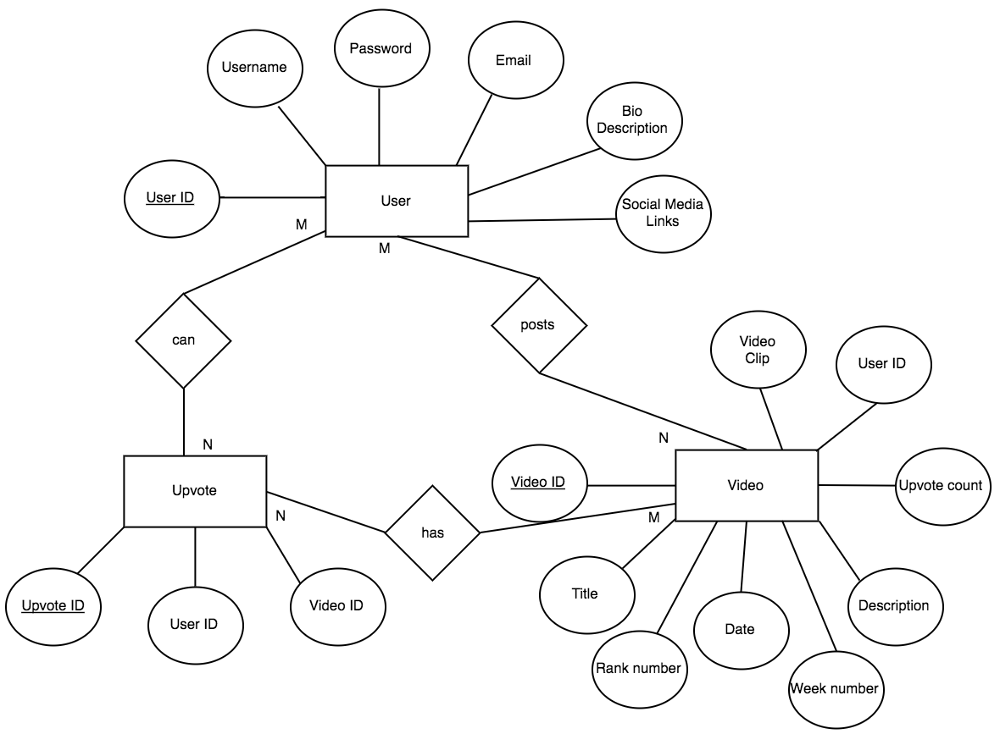

## 7.0 Detailed Design Specification 

### 7.1 Introduction

This document presents a detailed description of the software for a web application called OneUp. OneUp contains user-uploaded skate clips that are curated by upvotes and downvotes from other users. 

### 7.2 Detailed Design Description

The following sections contain the descriptions of the details of the design of OneUp’s CSCI. The design is systematically described in terms of the CSCs for the project, and the CSUs for each CSC. 

#### 7.2.1 Client-Side/Front-End CSC Description 

The front-end is composed of multiple React JS components serving as the web-pages for the client. These components are routed to one another so that the client can easily switch between web-pages. User activities include creating an account, signing in, changing settings, viewing clips, viewing profiles uploading clips, and upvoting clips. Our implementation of these functions involves some components using JavaScript methods to execute these functions. If the component doesn’t have any JavaScript methods, the functionalities are implemented through HTML using React JS. Each component is considered its own class. 

##### 7.2.1.1 Routing CSU Description (Main.js)

This component sets up the routing that allows users to switch between web-pages. 

##### 7.2.1.2 Navbar CSU Description (Header.js)

Each page will have a navbar component located on the top right of the webpage. This navbar allows users to switch between web-pages by clicking on the tabs within the navbar. 

##### 7.2.1.3 Sign In CSU Description (SignIn.js)

The main function of this CSU is to allow users to sign in to their profile or to create an account. The layout of this component is a form that asks users to enter a username and password. After the user has entered that information, the user would click the “Login” button located right under the forms to login. Clicking the login button would fire off a function in our Node JS server that uses Passport JS to authenticate the user. If the user does not have an account, there is another button under the forms labeled “Create Account”. When clicking the button, the SignIn panel would hide and the CreateAccount panel would appear. This is handled through a JavaScript method within this component, showSignUpBox(). 

##### 7.2.1.4 Profile CSU Description (Profile.js)

The profile component displays the user profile picture, name, username, a settings button to adjust settings, a upload clip button to upload a skate clip, the clips that the user has uploaded, and the clips that the user has upvoted. When the user clicks the settings button or upload clip button, that is handled through a JavaScript method within the component, handleClick(). The handleClick() method will redirect the user to the respective forms to either change settings or upload a clip. 

##### 7.2.1.5 Upload Video CSU Description (UploadVideo.js)

The main function of this CSU is to allow users to upload a clip. The upload video component is another form that asks users to attach a clip, enter a title for the clip, and enter an optional description. Once the user completes the form, there is a button on the bottom of the panel to submit the clip. The component has one JavaScript method, closeWindow(), to close the UploadVideo panel and return to the user profile page. 

##### 7.2.1.6 Settings CSU Description (Settings.js)

The main function of this CSU is to allow users to edit their profile. The layout of this component is a panel containing a form within it. The form gives users the chance to change their profile picture, edit their bio, and edit their social media links. There is a button on the bottom of the panel that users would click to commit these changes to their profile.  Once the button is clicked, our Node JS server will signal our database to update those changes. The component has one JavaScript method, closeWindow(), to close the Settings panel and return to the user profile page. 

##### 7.2.1.7 Home CSU Description (Home.js)

The home component will display the clips that users upload to the site, organized by number of upvotes and by week or all time. Users can view the clips where they simply click on the thumbnail to watch it. This is handled through a JavaScript method, viewClip(), where a modal component would pop up that has the clip, the description of the clip, the title of the clip, the user that uploaded the clip, and the number of upvotes that the clip has. If a user wants to view the profile of the user who uploaded the clip, the user simply clicks on the username located right next to the thumbnail. This is handled through a JavaScript method, viewProfile(), where it will redirect to the user’s profile page. If the user wishes to upvote or downvote a video, the user simply clicks the up or down arrow located on the right of the thumbnail. This will fire off a function within our Node JS server to update the amount of upvotes within the database. If the user wishes to organize the clips by all time, the user would click the “All-Time” label at the top of the page. If the user wishes to organize the clips by week, the user would click the “Week” label at the top of the page. These are handled by JavaScript methods within the component called AllTime() and Week(). 

##### 7.2.1.8 Video Modal CSU Description (OneUpVideo.js)

The video modal component displays the clip, the title of the clip, the description of the clip, the user that uploaded the clip, and the number of upvotes that the clip has. When the user clicks the thumbnail, the video will begin to play. This is handled by a JavaScript method within the component, showVideo(). If the user wishes to upvote the video the user would click the up arrow located on the right of the thumbnail. The upvotes of the video are incremented through a JavaScript method within the component called incrementVote(). If the user wishes to view the profile of the user that uploaded the clip, the user would click on the username located underneath the thumbnail. This is handled through a JavaScript method within the component called viewProfile(). If the user wishes to go back to the home page, the user simply clicks on the red x located on the top right of the modal. This is handled by a JavaScript method within the component called backHome(). 

##### 7.2.1.9 About CSU Description (About.js)

This component simply displays a few paragraphs that describes this web app. 

### 7.3 Database CSU Design Description 

#### ERD for the database description -- Because MongoDB is non-relational, the “entities” in the following diagram are the collections in our mongo database. 

	
	

OneUp uses MongoDB databases  that stores all information of OneUp users in a document. Each document is stored  in JSON file (javascript object notation). Each of these document is stored in a collection divides the document into chunks of collections.

#### 7.3.1 User collection

##### 7.3.1.1 
In this collection, all users data are stored here. Examples of users data
  - User ID: this uniquely identifies each user. Also, other collection refer to each user by using the user id..
  - Username: a username is used to be displayed in the website.
  - Password: stores a password of username when signing in.
  - Image profile:  users can add their own images to their profile.
  - Social media links: Users can add their social media links. 
  
#### 7.3.2 Video Collection

##### 7.3.2.1 
The video collection has a relationship to the user entity because it needs them to relate the videos to a specific user.
  - Video ID: this uniquely identifies each videos.  It determines the videos a user has.
  - Title: Each video has a title a user can add.
  - Description: a user can add a description for 
  - Rank number: Each video will be ranked in the website based on upvotes. This will also expose the user more in the main page  so others can see the high ranked video.
  - Date: Each video is stored in the database will have the data of upload.
  - Video clip: This is the video itself stored 
  - Week number: Week number is used to display videos on the homepage.
  - User ID: Video entity needs a user id to distinguish which video belongs to which user. (Note: This can be done in MongoDB by embedding document inside each other )
  
  
#### 7.3.3 Vote collection

#####7.3.3.1 
The vote collection has a relation between the video collection and the user collection.
  - Upvote ID:  upvote id uniquely identifies which video has the highest up votes so the video can be listed on the top on the homepage. 
  - Video ID: vote entity needs the video id from the video entity.
  - User ID: vote entity needs user id to distinguish which video belongs to which user and how many votes it has. (Note: This can be done in MongoDB by embedding document inside each other)
  
### 7.4 Detailed Interface Description

#### 7.4.1 Node JS Server Description 

Communication between the front-end and our Mongo cloud database will be handled through our Node JS server. Storing and retrieving data will be handled by ‘GET’ and ‘POST’ requests from the express npm module. 

The Node JS server will establish a connection with our Mongo cloud database on mLab. Our server uses the mongoose npm module to perform database related functions such as querying data, storing data, and creating schemas. Once the connection with the cloud database is established, our server creates the necessary schemas needed for the database. The front-end uses form-based UIs for clients to store data in the database. Once the client fills out the form and clicks a button to submit that form, that will trigger one of the ‘POST’ request functions in our server. That function will use mongoose to store the data. The data will be converted to JSON and stored in the cloud database. With the utilization of MongoDB, the data will be organized by collections and documents. 

Along with ‘POST’ requests within the server, there are also ‘GET’ requests. These ‘GET’ requests will retrieve the proper web pages for the client depending on the URL. In addition, these requests will also use mongoose to query the database for data associated with each web page. The cloud database will retrieve the data and pass it onto the server as JSON. The server will take that JSON data and pass it onto the front-end to be displayed on the web page.

