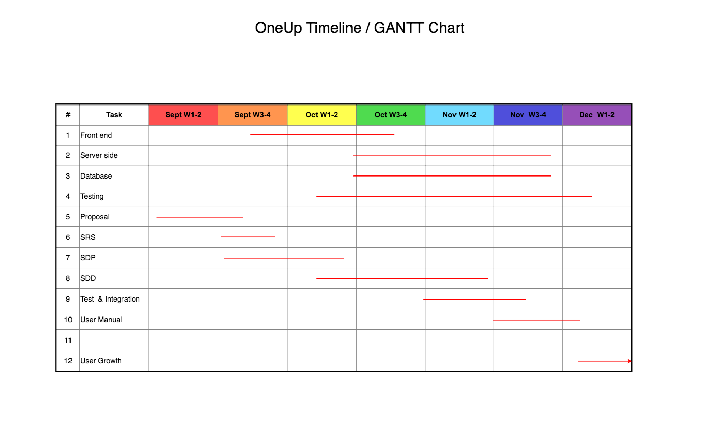

## 4.4 Project Schedule

### 4.4.1 GANTT Chart

	
	

### 4.4.2 Task/Resource Table

We plan on doing everything together without splitting up the workload too much.

Person     | Hardware              | Software                          | Task          
---------- | --------------------- | --------------------------------- | ----------------------------------------------------
Khiem      | Macbook Pro           | Node.js, React, MongoDB, macOS    | Building front end, server, database. Home page. Designing interface.
Justin     | Macbook Pro           | Node.js, React, MongoDB, macOS    | Building front end, server, database. User profile page.  
Abdul      | Macbook Pro           | Node.js, React, MongoDB, macOS    | Building front end, server, database. Uploading videos.

### 4.4.3 Class Schedule

http://bjohnson.lmu.build/cmsi401web/classnotes.html

- Week 01
   - Meet & Greet
   - Intro & Syllabus
   - Generic Production Process Steps
   - Parts of the Software Engineering Process
   - Project Ideas
   
- Week 02
   - Presentation for possible project – Dr. Bo Oppenheim
   - RFP Details
   - Life Cycle Models
   - Horror stories and Ethics
   
- Week 03
   - SOW Documents
   - Needs Analysis
   - Requirements Documents
   - Peer Review Process
   
- Week 04
   - Project proposal presentation(s)
   - Software Development Plan
   - To Be Announced
   
- Week 05
   - Requirements Document
   - Preliminary Schedule
   - Brief Intro to UML
   
- Week 06
   - Reading/Synopsis assignment 1 essay papers due/discussions
   - Architectural Design
   - Design Reviews
   
- Week 07
   - Software Development Plan Document
   - Unit and Integration Test
   - Review and Discussion of Deliverables
   
- Week 08
   - Special Guest Speaker: TBA
   
- Week 09
   - Student project status updates
   
- Week 10
   - Prelimineary Design Review Presentations
   - Software Design Description Document (Architecture Section)
   - Student project status updates
   - Special Guest Speaker: To Be Announced
   
- Week 11
   - Project Team Meetings and Coding for remainder of class
   
- Week 12
   - Student project status updates
   - Critical Design Review (CDR) Presentations
   - Software Design Description Document (Detailed Section)
   
- Week 13
   - Project Team Meetings and Coding for remainder of class

- Week 14
   - AlphaBeta Project Presentations
   - Test Plan Document

- Week 15 
   - Code Peer Review
   - User's Manual Final Updates
   - Student project status updates
   - Project Management Review and Spin Doctoring
   
- Week 16
   - Final SDF Submission; All Feedback Incorporated

