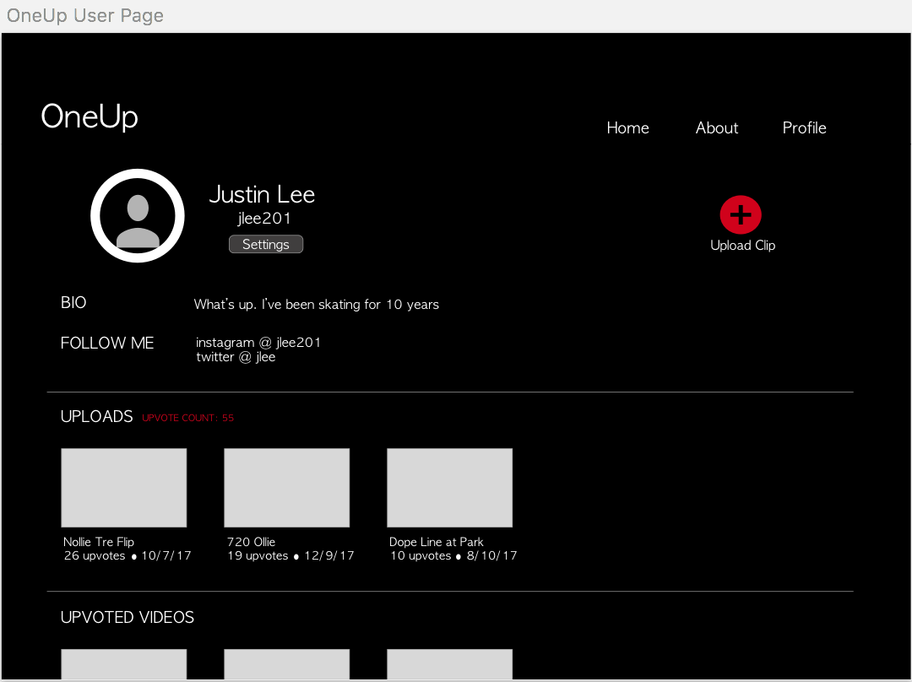

## User Manual

### How to Run OneUp Locally

In the command line:

- Step 1) Create a folder and clone the repo into the folder ```git clone https://github.com/abdulazizasiri/OneUp.git```

- Step 2) ```cd OneUp```

- Step 3) ```npm install```

- Step 4) ``` cd src/app/server-side ```

- Step 5) ```webpack && node server.js ```

- Step 6) Run http://localhost:3000/ on your web browwer 

- Step 7) Stop running the appliaction by hitting ```control + c ```

----------


### OneUp User Manual

#### How to Get Started

- Step 1) Sign up by creating an account!

- Step 2) Login to your new OneUp account.

- Step 3) You can now upload skate clips!

- Step 4) View and vote on other skate videos on the Home page.

#### Using OneUp

- ##### Home Page
  - This is where you can watch and vote on the best skate clips!
  - Videos can be filtered by Week or by All-Time via clicking the tabs on the top left of the 'Home' page.
  - Upvote or downvote videos on the right-side of each video by clicking the up or down arrows. 
  
  <p align="center">
	
  </p>

- ##### Profile
  - This is your personalized page for OneUp!
  - Upload videos by clicking the '+' button on the upper right hand corner.
    - Attach a video along with a title & description in the form
    - Click the 'Upload' button to have your video posted on the 'Home' page for others to see and vote!
  - Change Settings
    - The settings button can be found under the username of the 'Profile' page.
    - Fill in desired changes to your account and click the 'Save' button! Your new settings should be updated on your profile page.
  - View your uploaded videos in the 'Uploaded Videos' section of the 'Profile' page
  - View the videos you have upvoted in the 'Upvoted Videos' section.
  
  <p align="center">
	
  </p>
  
- ##### Video Modal
  - Every time a video is clicked, a video modal (popup window) will appear.
  - This will allow you to watch the video and also vote on it!
  
  
- ##### How Does Voting Work?
  - You can only upvote or downvote a video once. The amount of votes for each video will filter the list by highest number of upvotes on the top to lowest number of upvotes. 
  
  
#### Contact

For any further questions or comments, feel free to email us at oneupskat3@gmail.com

 

